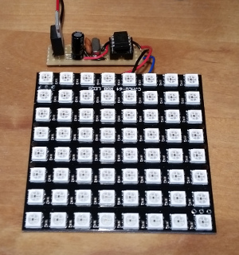

<h1>8x8 64 LED Matrix WS2812</h1>
<table>
<tr><th>Date</th><td>2016-04</td></tr>
<tr><th>Tool Version</th><td>Arduino IDE 1.6.5 (Windows) (arduino.avrdude=6.0.1-arduino5, arduino.avr-gcc=4.8.1-arduino5)</td></tr>
<tr><th>Keywords</th><td>LED, WS2812, Arduino Uno, ATmega328, ATtiny45, AVR assembler</td></tr>
</table>

<h2>Introduction</h2>

This program displays three 3x3 pixel color changing balls running over an 8x8 LED WS2812 Matrix.

There are two versions, one for the Arduino Uno rev3 running at 16MHz and one for an ATtiny45 running at 20MHz.

<h2>License</h2>

<a href="LICENSE.md">MIT License</a>

<h2>Hardware Configuration</h2>

<table>
  <tr><th></th><th>ATmega328P (Arduino Uno rev3)</th><th>ATtiny45</th></tr>
  <tr><th>Clock</th><td>extern 16MHz</td><td>extern 20MHz</td></tr>
  <tr><th>Voltage</th><td>5V</td><td>5V</td></tr>
  <tr><th>Current</th><td></td><td>max 150mA</td></tr>
</table>

<h2>Compiling the Software</h2>
If you don't want to compile yourself, upload the included .hex file with avrdude.
<ul>
  <li>If you don't have a 'make' get and install it (http://gnuwin32.sourceforge.net/packages/make.htm)</li>
  <li>Open command line box, change directory to the source folder of this project</li>
  <li>Check the settings at the top of the 'Makefile'</li>
  <li>ATmega328P: Run 'make MCU=atmega328p' to create the hex file</li>
  <li>ATtiny45: Run 'make MCU=attiny45' to create the hex file</li>
</ul>

<h2>Setup and Upload</h2>

<h3>ATmega328</h3>
<ul>
  <li>Run 'make MCU=atmega328p Upload' to upload the hex file</li>
  <li>Connect Arduino's 5V, GND and Digital Pin 8 to the LED matrix' 5V, GND and DIN pins</li>
</ul>

<h3>ATtiny45</h3>
<ul>
  <li>To upload the hex file to the ATtiny45 with an Arduino Uno board as programmer follow the instructions on http://highlowtech.org/?p=1695 'connecting an Arduino (as ISP) to an ATtiny'</li>
  <li>Run 'make MCU=attiny45 Upload' to upload the hex file</li>
  <li>Run 'make MCU=attiny45 BurnFuse' to switch the ATtiny to use an external clock source. Warning: After burning the Fuse you cannot use the ATtiny45 without an external clock (not even reprogram to clear the fuse)!</li>
  <li>Setup ATtiny45, 20MHz oscillator, two 22pF capacitors, 10uF capacitor and the LED matrix as shown in the <a href="Led-8x8.png">image</a></li>
</ul>

<h2>links</h2>
<ul>
  <li>http://www.atmel.com/images/Atmel-8271-8-bit-AVR-Microcontroller-ATmega48A-48PA-88A-88PA-168A-168PA-328-328P_datasheet_Complete.pdf</li>
  <li>http://www.atmel.com/Images/Atmel-2586-AVR-8-bit-Microcontroller-ATtiny25-ATtiny45-ATtiny85_Datasheet.pdf</li>
  <li>http://www.atmel.com/Images/Atmel-0856-AVR-Instruction-Set-Manual.pdf</li>
</ul>
<ul>
  <li>http://www.world-semi.com/uploads/soft/150522/1-150522091P5.pdf</li>
  <li>http://eleccelerator.com/fusecalc/fusecalc.php?chip=attiny45&LOW=FF&HIGH=DF&EXTENDED=FF
</ul>

