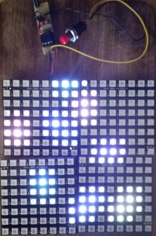

<h1>8x8 64 LED Matrix WS2812</h1>
<table>
<tr><th>Date</th><td>2016-04</td></tr>
<tr><th>Tool Version</th><td>Arduino IDE 1.6.5 (Windows) (arduino.avrdude=6.0.1-arduino5, arduino.avr-gcc=4.8.1-arduino5)</td></tr>
<tr><th>Keywords</th><td>LED, WS2812, Arduino Uno, ATmega328, ATtiny45</td></tr>
</table>

<h2>Introduction</h2>

This program displays animations on one, two or four 8x8 LED WS2812 matrices. You can switch between the animations by pressing a button.

There are two versions, one for the Arduino Uno rev3 running at 16MHz and one for an ATtiny45 running at 20MHz.

<h2>License</h2>

<a href="LICENSE.md">MIT License</a>

<h2>Hardware Configuration</h2>

<table>
  <tr><th></th><th>ATmega328P (Arduino Uno rev3)</th><th>ATtiny45</th></tr>
  <tr><th>Clock</th><td>external 16MHz</td><td>external 20MHz</td></tr>
  <tr><th>Voltage</th><td>5V</td><td>5V</td></tr>
  <tr><th>Current</th><td></td><td>&lt; 2A</td></tr>
</table>

<h2>Configuring the Software</h2>

The layout of the LED matrices is defined in ledMatrix.h:
<ul>
  <li>#define MATRIX_8x8 One 8x8 LED matrix</li>
  <li>#define MATRIX_2X8x8 Two 8x8 LED matrices, giving 16x8 LEDs; left: LEDs 0 to 63, right: LEDs 64 to 127</li>
  <li>#define MATRIX_2x2X8x8 Four 8x8 LED matrices, giving 16x16 LEDs; top: LEDs 0 to 127, bottom: LEDs 128 to 255</li>
</ul>

If you use a different layout (e.g. 3x1) you have to add a new #define. In ledMatrix.h you have to add some constants for the new layout and in ledMatrix.cpp you have the add the conversion calculation from x/y coordinates to LED index and vice versa.

If you want to add an animation, you have to implement an initialization function and a run function. Then you have to add the function calls to the led-8x8.asm file. Please consider that the RAM of the ATtiny45 is too small for a memory mapped display and calculating the each pixel color must be done within 50us because of the WS2812 protocol. However you can use an ATtiny85 with more memory or an ATmega328P where memory is not an issue at all.

<h2>Compiling the Software</h2>

If you don't want to compile yourself, upload the included hex file (using one 8x8 matrix) with avrdude.

<ul>
  <li>If you don't have a 'make' get and install it (http://gnuwin32.sourceforge.net/packages/make.htm)</li>
  <li>Open command line box, change directory to the source folder of this project</li>
  <li>Check the settings at the top of the 'Makefile'</li>
  <li>ATmega328P: Run 'make MCU=atmega328p' to create the hex file</li>
  <li>ATtiny45: Run 'make MCU=attiny45' to create the hex file</li>
</ul>

<h2>Setup and Upload</h2>

<h3>ATmega328</h3>
<ul>
  <li>Run 'make MCU=atmega328p Upload' to upload the hex file</li>
  <li>Connect Arduino's 5V, GND and Digital Pin 8 to the LED matrix' 5V, GND and DIN pins, connect Arduino's GND and Digital Pin 2 with a push button as shown in the <a href="Led-8x8.png">image</a></li>
</ul>

<h3>ATtiny45</h3>
<ul>
  <li>To upload the hex file to the ATtiny45 with an Arduino Uno board as programmer follow the instructions on http://highlowtech.org/?p=1695 'connecting an Arduino (as ISP) to an ATtiny'</li>
  <li>Run 'make MCU=attiny45 Upload' to upload the hex file</li>
  <li>Run 'make MCU=attiny45 BurnFuse' to make the ATtiny45 use an external clock source. Warning: After burning the Fuse you cannot use the ATtiny45 without an external clock (not even reprogram to clear the fuse)!</li>
  <li>Setup the ATtiny45, 20MHz oscillator, two 22pF capacitors, 10uF capacitor, push button and the LED matrix as shown in the <a href="Led-8x8.png">image</a></li>
</ul>

<h2>Links</h2>
<ul>
  <li>http://www.atmel.com/images/Atmel-8271-8-bit-AVR-Microcontroller-ATmega48A-48PA-88A-88PA-168A-168PA-328-328P_datasheet_Complete.pdf</li>
  <li>http://www.atmel.com/Images/Atmel-2586-AVR-8-bit-Microcontroller-ATtiny25-ATtiny45-ATtiny85_Datasheet.pdf</li>
  <li>http://www.atmel.com/Images/Atmel-0856-AVR-Instruction-Set-Manual.pdf</li>
</ul>
<ul>
  <li>http://www.world-semi.com/uploads/soft/150522/1-150522091P5.pdf</li>
  <li>http://eleccelerator.com/fusecalc/fusecalc.php?chip=attiny45&LOW=FF&HIGH=DF&EXTENDED=FF
</ul>

